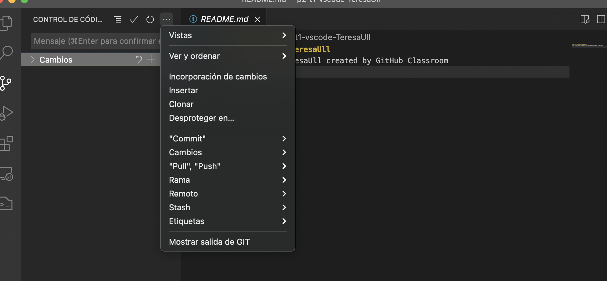
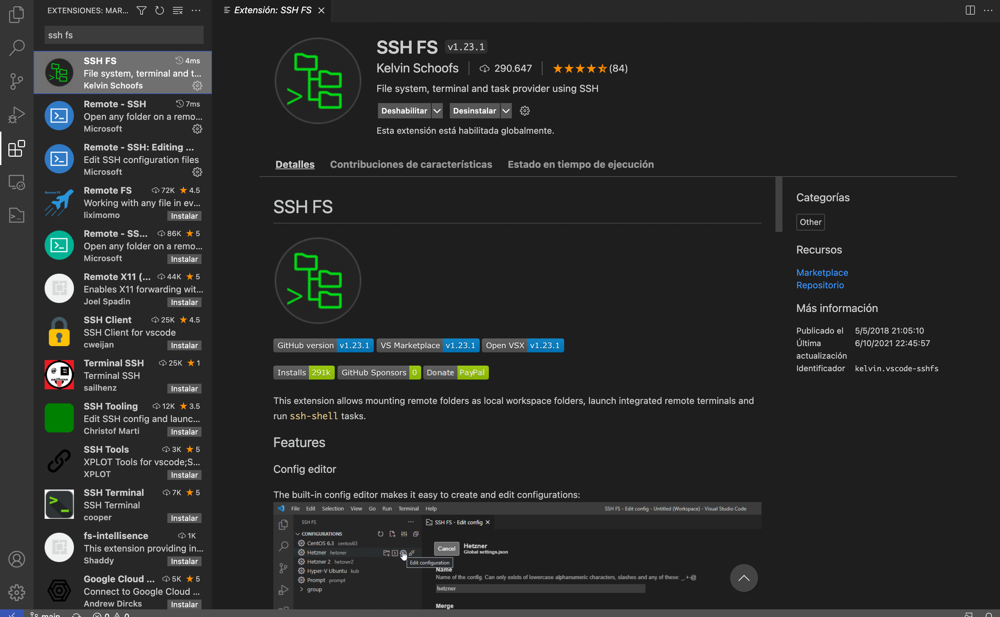
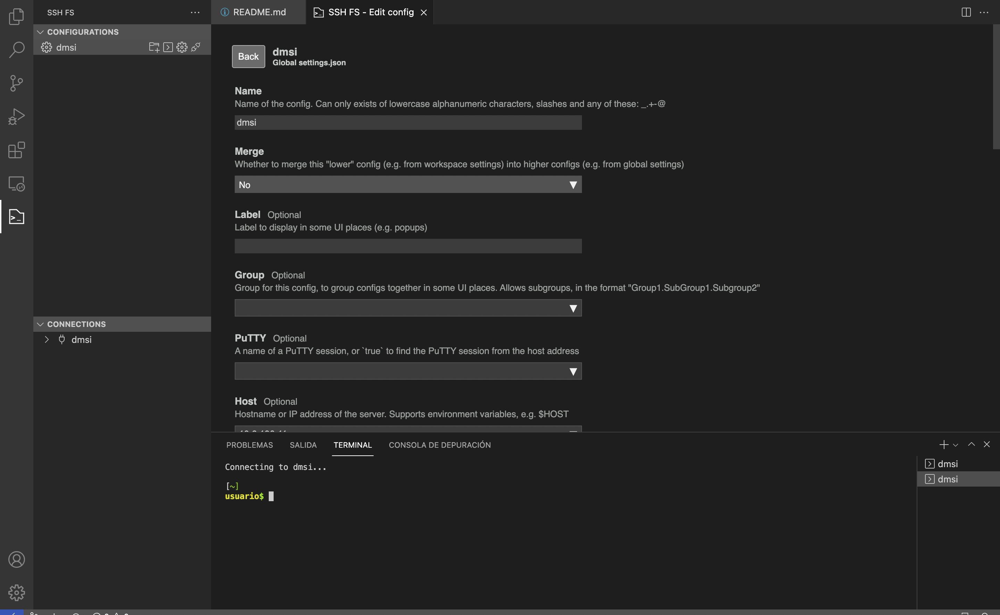

Teresa Bonet Costa

# Práctica 2: Editores: Visual Studio Code y GitPod

Visual Studio Code es un editor de código, se puede por tanto desarrollar código en cualquier lenguaje instalando las extensiones necesarias para ello. También incluye soporte para la depuración, control integrado de Git, resaltado de sintaxis, finalización inteligente de código, fragmentos y refactorización de código. También es personalizable, por lo que los usuarios pueden cambiar el tema del editor, los atajos de teclado y las preferencias. Es gratuito y de código abierto.

# 1. Descarga VS Code

Descargar VS Code es muy sencillo, simplemente debemos ir a la página oficial de [VSCode](https://code.visualstudio.com/download) y instalar el paquete para el sistema operativo que tengamos.

# 2. Clonar un repositorio 

Una vez estamos en VSCode tenemos varias opciones, entre ellas podemos clonar un repositorio que tengamos en Github y así editarlo en local, para ello simplemente debemos clicar en clonar repositorio y pegar el link del repositorio que queramos clonar. 

# 3. Control de versiones

VS Code es muy cómodo para trabajar sobre un mismo código con diferentes versiones, ya sea una misma persona o diferentes personas. De forma muy intuitiva te permite unir las diferentes ramas que se han ido creando.
Como vemos en la imagen, podemos acceder a cualquier tipo de cambio que queramos hacer en nuestro código. 

# 4. SSH FS
De sus siglas, Secure SHell FileSystem, es un sistema de archivos para Linux, que opera sobre archivos en una computadora remota usando un entorno seguro de acceso. En la computadora local donde se monta SSH FS, la implementación hace uso del módulo del kernel FUSE. De este modo, podemos interactuar con archivos remotos se forma segura con el servidor SSH como si estuviesen localmente.

Vamos a configurar esto de modo que podamos acceder a la máquina virtual del IaaS de la universidad para DMSI desde VSCode. 

# 5. Live Share

La extensión de Live Share nos permite trabajar en un fichero de forma remota con colaboradores en tiempo real, tiene de forma integrada tanto audio como chat. 